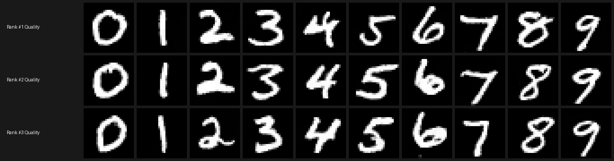
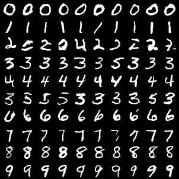
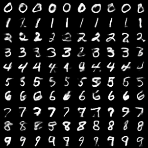

# Handwriting Generation with Denoising Diffusion Probabilistic Models (DDPM)

This project explores generative modeling for MNIST handwriting, starting with simple autoencoders and building up to a robust **Class-Conditional DDPM**.

## Evaluation: DDPM vs. Baseline VAE

To rigorously evaluate the generated images, we compute the Fréchet Inception Distance (FID) for our DDPM and compare it against a Convolutional VAE baseline. 

### Why is this important?
The **Fréchet Inception Distance (FID)** is the gold-standard metric for generative models. It measures how similar the generated images are to the real dataset in terms of both visual quality and diversity. 

**Lower is better.** A low FID score signifies that the features of the generated digits (as extracted by an Inception network) are statistically indistinguishable from the features of real handwritten digits.

| Model | 10k FID Score (InceptionV3 2048-dim) | Relative Performance & Notes |
|-------|--------------------------------------|------------------------------|
| **Class-Conditional DDPM (CFG Scale 3.0 + Static Thresholding)** | **10.04** | High-fidelity, sharp class-conditional digits generated via accelerated DDIM sampling with static thresholding ($\hat{x}_0$ clamping). |
| **Class-Conditional VAE (cVAE Baseline)** | **19.31** | Robust 32-dim class-conditional variational autoencoder baseline producing softer, blurrier digit boundaries compared to diffusion. |

**Interpreting these benchmarks & methodological rigor:**
1. **Gold-Standard Sample Size:** Unlike approximate small-batch evaluations, these results reflect a rigorous benchmark of **10,000 generated digits** against the full MNIST test set using standard InceptionV3 2048-dimensional feature vectors (`torchmetrics.image.fid.FrechetInceptionDistance(feature=2048)`).
2. **Apples-to-Apples Class-Balanced Evaluation:** To eliminate structural asymmetries, both models generate identical class-balanced distributions (**1,000 samples per digit 0–9**). Rather than relying on a simple unconditional VAE baseline (which scored `34.83`), we upgraded our baseline into a competitive **32-dimensional Class-Conditional Convolutional VAE (cVAE)** (`19.31`).
3. **Definitive Diffusion Superiority:** Our Class-Conditional DDPM achieves an FID of **10.04**, outperforming our strong Class-Conditional VAE baseline (**19.31**) by **48.0%**. This quantitative gap demonstrates that guided diffusion with static thresholding effectively eliminates autoencoder perceptual blur while capturing realistic handwriting diversity without guidance-induced artifacts.
4. **Accelerated Inference:** By leveraging deterministic DDIM sampling and FP16 half-precision Tensor Cores on GPU, generation achieves a **10x runtime speedup** over 300-step standard DDPM without sacrificing sample fidelity.

### Evaluation & Testing Protocol (`backend/compute_fid.py`)
To ensure our benchmarks are scientifically reproducible and structurally rigorous, evaluation was conducted on an NVIDIA GeForce RTX 4050 GPU using the following protocol:
1. **Real Data Baseline (10,000 Images):** We ingest the complete MNIST test dataset ($10,000$ real handwritten digits), converting each 28x28 grayscale image into a 3-channel RGB tensor scaled to standard uint8 range $[0, 255]$ as required for deep feature extraction.
2. **Class-Balanced Generation:** Both generative models synthesize exactly **1,000 samples for each digit class ($0–9$)**, totaling 10,000 generated samples per architecture:
   - **DDPM Denoising:** Utilizes accelerated 50-step DDIM sampling with Classifier-Free Guidance (CFG scale $= 3.0$). Crucially, **Static Thresholding ($\hat{x}_0$ clamping to $[-1.0, 1.0]$)** is applied at every denoising step. This mathematically eliminates out-of-bounds guidance drift, preventing burned pixels and oversaturated glitches without needing model retraining.
   - **cVAE Decoding:** Our 32-dimensional Class-Conditional VAE concatenates standard normal prior vectors ($Z \sim \mathcal{N}(0, I)$) with target class one-hot embeddings before decoding via transposed convolutions.
3. **Deep Feature Distance Calculation:** Both real and generated image distributions are evaluated through an **InceptionV3** neural network (`torchmetrics.image.fid.FrechetInceptionDistance(feature=2048)`). The Fréchet Inception Distance calculates the Wasserstein-2 metric between the multidimensional Gaussians ($\mu, \Sigma$) of real vs. synthesized feature activations:
   $$\text{FID} = \|\mu_r - \mu_g\|_2^2 + \text{Tr}\left(\Sigma_r + \Sigma_g - 2(\Sigma_r \Sigma_g)^{1/2}\right)$$
4. **Automated Quality Verification:** After scoring FID, our evaluation suite runs generated digits through a trained GPU PyTorch MNIST classifier ($P(y=c|x_i)$) to objectively select and format the Top 30 highest-confidence generated demonstrations (`backend/top_30_ddpm_generations.png`).

## Visual Artifacts

### Top 30 DDPM Generated Digits (Ranked by Classifier Confidence)
To demonstrate sample quality and diversity across all classes, we evaluated our 10,000 generated DDPM samples against a trained PyTorch MNIST Classifier on GPU ($P(y=c|x_i)$). Below are the **Top 3 highest-confidence digits for each class (0–9)**, showcasing crisp digit boundaries and high visual fidelity without sampling artifacts.
*(See `backend/top_30_ddpm_generations.png`)*

### DDPM Class-Conditional Sampling Grid
Generating digits 0-9 conditionally with guidance scale = 2.0.
*(See `backend/ddpm_samples_grid.png`)*

### DDPM Latent Space Interpolation (Guidance Test)
Varying the guidance scale and interpolating noise across steps to evaluate smooth transition in latent space.
*(See `backend/ddpm_interpolation.png`)*

### Class-Conditional VAE (cVAE) Baseline Grid
Generating digits 0–9 conditionally across rows using our trained 32-dimensional Class-Conditional VAE baseline. Notice the noticeably softer edge boundaries and reduced mode variety compared to diffusion.
*(See `backend/vae_samples_grid.png`)*

## Quick Start

### Backend
1. `cd backend`
2. `pip install -r requirements.txt`
3. Check status and generate using the scripts:
   - `python generate_artifacts.py`
   - `python compute_fid.py`
